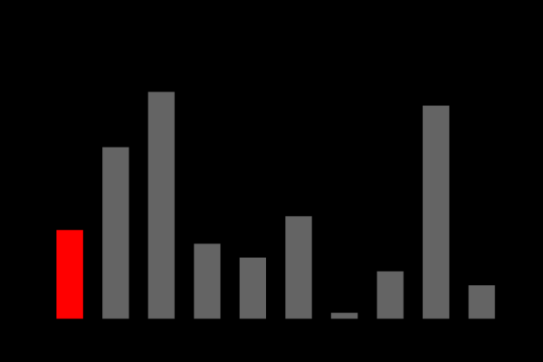

# Algoritmos de Ordenação

Nestes arquivos implementei diversos algoritmos de ordenação para fins de estudo. Neste documento serão explicados de modo bem sucinto o princípio que cada método de ordenação segue.

## Bubble Sort
Seu funcionamento se baseia em percorrer o vetor várias vezes, sempre analisando elementos adjacentes. Caso o elemento da posição i seja maior que o da posição (i + 1), eles são trocados de posição. Isso garante que a cada varrida no vetor o maior elemento vá para a última posição, assim organizando os elementos.

## Selection Sort
Assim como o Bubble Sort, o Selection Sort também percorre o vetor várias vezes. A cada varrida, o algoritmo procura o menor elemento para movê-lo para o início da lista.

## Insertion Sort

O Insertion Sort toma como base um elemento pivô numa determinada posição i. À esquerda dele, os elementos estarão ordenados, e a direita não. O pivô, então, é colocado na sua devida posição nesse subvetor ordenado e a posição (i + 1) se tornará pivô. O processo começa com i = 1 e termina no final da lista.

## Shell Sort
O Shell Sort funciona como uma extensão do Insertion Sort, pois ele permite a comparação entre elementos distantes do vetor. Ele determina uma distância entre os elementos a serem comparados (chamada de gap) e aplica a lógica do Insertion Sort nos elementos que são múltiplos desse gap. A cada gap definido, o vetor é percorrido e este salto vai sendo reduzido a cada laço até zerar, assim ordenando a lista. 

## Quick Sort

O Quick Sort escolhe um elemento pivô arbitrário do vetor. Em seguida, o percorre organizando de modo que os elementos menores que o pivô estejam a sua esquerda e os elementos maiores ou iguais que o pivô estejam a sua direita. Dai o algoritmo é chamado recursivamente para cada uma das partes, até que cada subvetor tenha tamanho 1, e enfim, esteja ordenado.

# Complexidade

Algoritmo | Melhor Caso | Pior Caso | Caso Médio
--- | --- | --- | ---
Bubble Sort | O(n) | O(n²) | O(n²)
Selection Sort | O(n²)| O(n²) | O(n²)
Insertion Sort | O(n) | O(n²) | O(n²)
Shell Sort | O(n lgn) ou O(n lg²n) | O(n²) ou O(n lg²n)| O(n^1,25) ou O(n * lg²n)
Quick Sort | O(n lgn)| O(n²) | O(n lgn)

Obs: As complexidades do Shell Sort dependem do gap e da lista a ser ordenada.

# Tempos de Execução

Após execução dos algoritmos para vetores de tamanhos n, os seguintes tempos de execução foram obtidos:

Algoritmo|n=5.000|n=10.000|n=20.000|n=40.000|n=80.000|n=160.000|n=320.000|n=640.000|n=1.280.000
--- | --- | --- | --- | --- | --- | --- | --- | --- | ---
Bubble Sort    | 0.109 s | 0.447 s | 1.845 s | 7.439 s | 30.523 s | 2.09 min  | 8.32 min | 33.04 min | 2 h 15 min 
Selection Sort | 0.026 s | 0.099 s | 0.389 s | 1.610 s | 6.480 s  | 25.895 s  | 1.94 min | 6.85 min  | 27.55 min
Insertion Sort | 0.017 s | 0.053 s | 0.244 s | 0.906 s | 3.698 s  | 14.768 s  | 59.943 s | 7.59 min  | 32.03 min 
Shell Sort     | 0.011 s | 0.050 s | 0.170 s | 0.710 s | 2.856 s  | 13.016 s  | 64.688 s | 5.22 min  | 21.79 min 
Quick Sort     | 0.001 s | 0.002 s | 0.011 s | 0.010 s | 0.020 s  | 0.025 s   | 0.052 s  | 0.112 s   | 0.245 s 